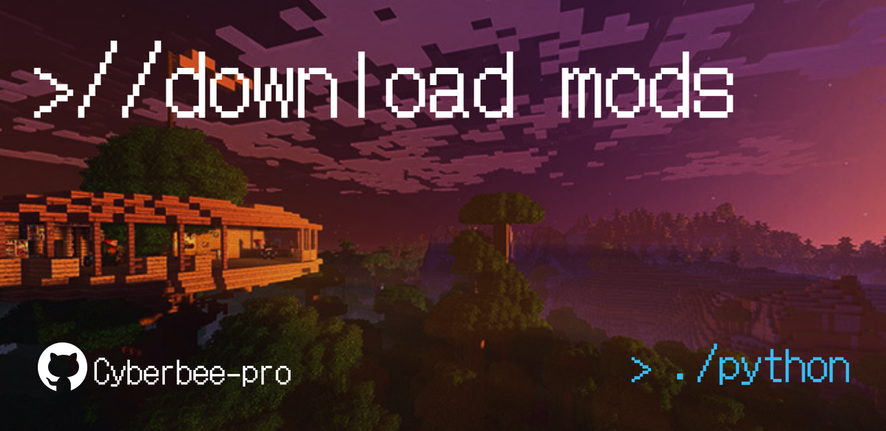

# Modrinth Automated Mod Downloader

A command-line interface (CLI) utility written in Python designed to query the Modrinth API (Labrinth v2), resolve Minecraft mod configurations, and recursively download primary files along with all specified required dependencies. The project includes a pre-configured GitHub Actions automation pipeline optimized for compiling standalone Linux binaries via PyInstaller inside an Arch Linux container environment.



---

## Features

* **Cross-Edition Support:** Filters queries natively based on game edition (Java or Bedrock).
* **Fuzzy Identification:** Resolves standard human-readable display names into exact Modrinth project IDs dynamically using filtered search facets.
* **Recursive Dependency Resolution:** Interrogates the target version metadata to map, track, and download all mandatory library and engine dependencies automatically.
* **Environment Safeguards:** Designed to function within isolated environments (`venv`) to sidestep PEP 668 external management constraints on modern Linux distributions.
* **Production Pipeline:** Includes a production-ready GitHub Actions workflow that handles semantic version calculations, collision checking, automated PyInstaller packaging, and automated GitHub Release publishing.

---

## Local Setup & Installation

### Prerequisites

The script requires Python 3.x and the `requests` library to manage HTTP communication streams with the Modrinth API registry.

To isolate dependencies and bypass system-wide package management restrictions:

```bash
# Clone the repository and enter the directory
cd mod-downloader

# Instantiate an isolated virtual environment container
python -m venv venv

# Activate the virtual environment context
source venv/bin/activate

# Install the tracking dependencies inside the active sandbox
pip install --upgrade pip
pip install requests pyinstaller

```

---

## Usage

### Running the Source Script

With the virtual environment active, execute the interactive script directly from the terminal:

```bash
python mod_downloader.py

```

Provide the targeted parameters when prompted by the terminal engine:

1. **Edition:** Select either `java` or `bedrock`.
2. **Version:** Define the exact Minecraft target release string (e.g., `1.21.6`).
3. **Platform/Loader:** If Java is chosen, input the loader ecosystem (`fabric`, `forge`, or `neoforge`). Bedrock profiles automatically map platform requirements.
4. **Mod Names:** Input names or slugs separated strictly by commas (e.g., `Fabric API, Terralith, Traveler's Backpack`).
5. **Save Path:** Designate the target filesystem directory for output storage (e.g., `./mods`).

---

## Building a Standalone Binary Locally

To distribute or execute the utility as a compiled, independent machine binary without requiring an active Python interpreter environment:

```bash
# Execute compilation while clearing incremental generation caches
pyinstaller --onefile --clean mod_downloader.py

```

### Execution

The output compilation configuration produces assets within the following layout:

* **`build/`:** Temporary runtime analytics metadata (safe to delete post-build).
* **`dist/`:** Contains the final compiled binary (`mod_downloader`).

To run the native output file on Linux systems:

```bash
cd dist
chmod +x mod_downloader
./mod_downloader

```

---

